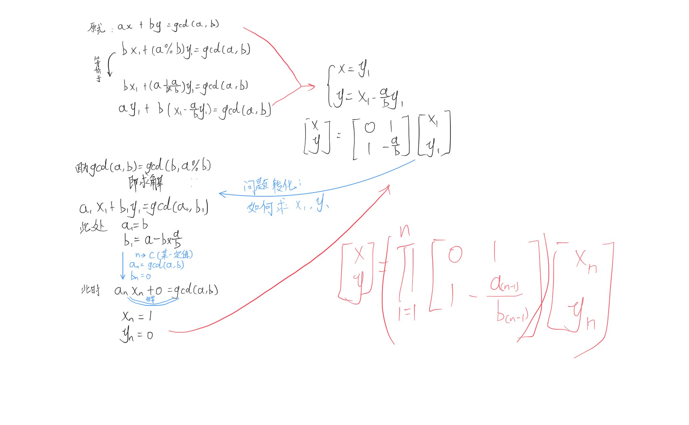
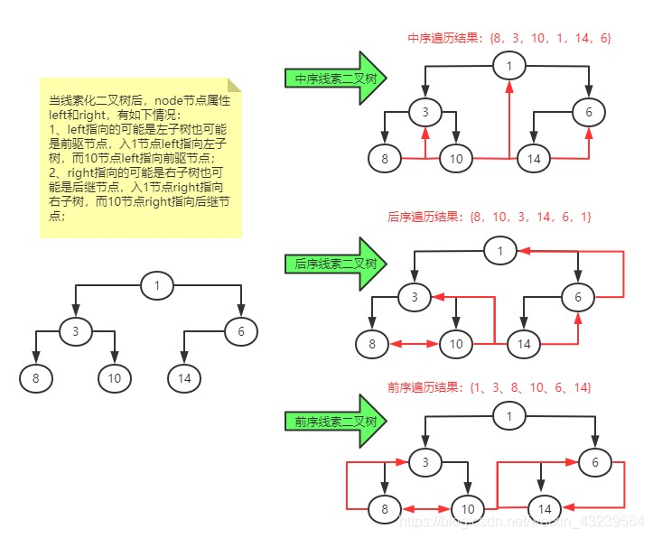

## Linked List

> 思考题：如何判断一个链表错误的产生自环？

node要在list的作用域内，是链表下属的一个概念。脱离链表，结点丧失意义。

**1.用Map储存所有的地址**

**2.快慢指针：**

​	一旦相逢就说明有环。

​	但步长的差可能会失效。

​	扩展:**裴蜀定理**

​	假设初始两个指针的位置是$a,b$，步长是$p,q$。

​	环的长度为$$L$$

​	求解$k$，满足条件：
$$
a+k\times q=b+k\times p \notag
$$
​	整理后，可转化为：
$$
a-b\equiv k\times(p-q) \tag{mod L}\\

a-b=k\times(p-q)+t\times(L)\\
$$
​	由裴蜀定理$ax+by\equiv gcd(a,b)$一定有解可知，$$k$$有解的条件为：
$$
gcd(p-q,L)|(a-b)
$$


在一些函数之后，加上const，以防止变量被修改。


```c++
void visit(...,fun)
{
	for(...p...)
		fun(*p)
}
```

使用户可以自定义操作函数


## 分治

**分(split)治(recursively)合(merge)**

为什么**”治“**是1？

* [ ] QuickSort//递推版本
* [ ] MergeSort


第K大元素，可以借助快排的思想进行。


## Abstract Data Type

## 扩展欧几里得



## 汉诺塔

$$
F(n)=2\times F(n-1)+1
$$

第$n$问题变为$n-1$问题的过程，发生了规模变化（-1）、顺序改变。

目标n个盘子1->3

P:(n-1)个盘子1->2

I:第n个盘子 1->3

Q:(n-1)个盘子 2->3

对于lowbit前的每一个数对应于一个(p或者q)操作。

[汉诺塔杂谈（三）——非递归算法 - 知乎 (zhihu.com)](https://zhuanlan.zhihu.com/p/36085324)


## 排列

1234

1243

1324

1342

...

先找到从末尾开始的反向最长上升子序列，翻转。

之后将前一个与子序列大于他的第一个数字交换位置。

## 树

### homework

1. 给定特地的树，输出遍历。
2. 给定两种遍历，形成特定的树（括号表示）。

### 线索二叉树




#### 前序遍历

无法处理6和3号节点，即为父亲右节点且有左节点存在的数据。

需要用堆栈辅助。

#### 后序遍历

无法处理$3\Rightarrow 4$.

需要堆栈辅助，一般来说只需要：堆入14.


### 哈夫曼树


## 堆Heap

形式上数组，意义上树。
$$
left child=2i+1\\

right child=2i+2\\

father=\lfloor\frac{i-1}{2}\rfloor\\
$$


删除：去除根节点，用最后一个元素代替根节点，往下交换传递，变为正确的顺序。

添加：放在底部，一步步向上传播。

N个节点的树，以上时间复杂度为O(NlogN)  


### 斐波那契堆

[算法 - 优先队列 - 斐波那契堆 | Earth Guardian (redspider110.github.io)](https://redspider110.github.io/2018/09/25/0105-algorithms-fibonacci-heap/)

## 二叉搜索树

左小右大

动态有序

### Treap（树堆）

### AVL树(https://cloud.tencent.com/developer/article/1155143)

* 条件一：它必须是二叉查找树。
* 条件二：每个节点的左子树和右子树的高度差至多为1。


### B树

### 红黑树

#### 性质约定

1. 节点是红色或黑色。
2. **根是黑色**。
3. 所有**叶子都是黑色**（叶子是**NIL**节点）。
4. **不存在**两个相邻的红色节点
5. 从任一节点到其每个叶子的所有简单路径都包含**相同数目的黑色节点。**


#### 动态调整

$Case\_1$


直接将父亲与叔叔染成黑色。

$Case\_2$


先进行左旋


再进行右旋


### 二叉树的应用

#### 维护前序排名

如果是**父节点的左儿子**，排名小于**父节点**的排名。

如果是**父节点的右儿子**，排名大于**父节点**的排名。

维护子树信息，提供查询排名接口。

查询依据是什么？

#### 正交查询（[扫描线 - OI Wiki (oi-wiki.org)](https://oi-wiki.org/geometry/scanning/#b-维正交范围)）

对于每一个扫描线的位置（竖直方向），查询哪些水平线段存在。

对于水平线段的竖直位置，用二叉搜索树维护。

对于每一个竖直线段，用上面这个二叉搜索树查询区间信息。

按照水平坐标，添加删除。

#### 范围内点集

给整个区间划分为单位长度固定的网格，对于已知坐标的点，可以**直接求**（做出发）出对应格子。

但问题的难度在于如何选择单位长度？

#### KD-Tree

K-Dimensional Tree

考虑$R^n$线性空间内的结点，每一个结点记录：

特征坐标、划分轴、左指针、右指针。

## CUBE

想明确一下作业要求：

> 已知魔方的三个面，背后三个面不确定，可被复原的概率。

问题可以被等效的转化为：

> 已知魔方三个未被打乱的面(如下图），魔方最终可被复原的概率。

![魔方_百度百科](data:image/jpeg;base64,/9j/4AAQSkZJRgABAQAAAQABAAD/2wCEAAkGBxIPERITEhIWFRUVFhYaFhcXFxYXGBcVFRUWFhYVGhMYHSghGh0lHRcXITElJikrLi4uGB8zODMtNygtLisBCgoKDg0OGxAQGi8lICUtLS01MC8tLS0tLy0tLjAtLS8uNS8tLS01LS0tLS0tLS0tNS0vLS0tLS0tLS0tLS0tLf/AABEIAOEA4QMBIgACEQEDEQH/xAAcAAEAAgMBAQEAAAAAAAAAAAAABgcDBAUBAgj/xABJEAABAwICBwQDCgsIAwAAAAABAAIDBBEFIQYHEjFBYXETIlGBMpHBFCMkQlJicqGx0Qg1U2NzdIKSs+HwJTNDZKOywsM0hPH/xAAbAQEAAgMBAQAAAAAAAAAAAAAAAwQBAgUGB//EADkRAAIBAgMFBgQEBQUBAAAAAAABAgMRBCExBRJBYXETUYGRsfAiocHRBhQjMiUzYnKCNKKy4fEk/9oADAMBAAIRAxEAPwC8UREAREQBERAEREAREQBERAEREAREQBERAEREAREQBERAEREAREQBERAEREAREQBERAEREAREQBERAEREAREQBERAEREAREQBERAEREAREQBERAEREAREQBERAEREAREQBERAEReFAeovAvUAREQBERAEREAREQBERAEREAREQBERAEREAREQBERAEReE2QHq8JUQx7T+lpQQw9s8cGEbN+b93quuFh2smKYOjqoO64EEszbY2HeY83t0J6KJ14J2udKlsjG1KfaKm7fPwTs2SLH9OaSkBAd2zx8VhFgfnP3DyueSrjHdOKqrJG12bODYyW+t2932clJanQuir2mShnAd8knaHjYj02ed+ihmNaKVVHftIyWj44zb+8N3nZVasqrV3py08z0myKGy4y3V/N7pq0k+SeXldrvN7BtOaumsO0EjB8WS7suR9Ieu3JTzBNYdNPZsodC7xObb/SGY8wOqrvR/Q+qrbEM2I/lvu0W5ZXPllzCm0WD4bhDQ+dzZZRnZwaTfxZDw3ZF3rSk6iV72XPT30G1qWzJT3FFur3U9b87Xj5pvuJ9FK17Q5pDmuAIINwQcwQeIWZU/jusmaQ2pgImjcSA5x63BaOgHmt7BNaDhZtTFtD5ceTvNhyPkR0Vj8zTvY4kvw9jlT391dL5r6eWfItJFycJx6nqx7zK1x4t3PHVhzXVupk01dHGnCUJbs001weTPURFk1CIiAIiIAiIgCIiAIiIAiIgCIvCUB6vCopj+nNJSXAd2rx8WMiwPzn7h5XPJVrpDptVVl27XZxn4jLgEeDnXufs5KCpiIR0zOxgdh4rFZ23Y97+i1fpzLqZWsftCN7HubvAcDY/OtchVhp6cU73a3EP5jaMdvnHf+/koJBVvjcHMe5rhuIcWkdCFM8E1k1EVmztEw8dz7fSA73mPNQOtGatLLpp4ndo7GxGz6na0FGrykrSX9rvZe8iEPBvnvXyBdXA3BcPxeMyxxPiPEtYGHa35t9B2/MjPmFkwnQSlpA572moe0Ehpa0DIXAEd7En5xt0Wiw8npZrv95lx/iXDwi1UhJTWW7bO/XTzs+RANFtG62ocHw7UYH+IS5gHRw9LyVm1ONRYdDsVVSZpAN1m7Z5bA3DLe45+KhelWnFXtOijY6naMsw4SWzHpEDZ/Z9agcjySSTcnMk5kk7yUjUjT/Zm+/h5fc0ns6vtJqeLtGHCMbN+Ms/JZckXPBpfSVzHRtqH07jkCS1jhn8V+Yz3bwfBQ3H9AaphMkbvdAOdwTtnjcs+N5EqEg2Uh0Yx2thc2OnL3AnKOzpAd3xfaLLDqqf714rXy0JFsqrgbzwVRJauM7Wy/qVmvd2cGaFzCWuBBG8WIIPgQdyyUVFLO8NiYXk7gGlx62HDmrtdQMqoA/EYIWuA73ezaP0uRbxy2iN2fh9Q07IKdxw2OAnh3rtd1kBJceRcOqkWGffl0z8ipL8TLd3VT+K9r7y3Ou93e7kSwHQIQATVkwiAsbNeAR1lOQ6N9a3sU1lQQkMp43TBuRJcRcDLe67ieZ+tQbSmornSfC+0BzsCCGgfNAy8x61wFH2u5lBW9S3T2S8ZatjKm/3KOUF0tm+uXO5d+Dae0lTYOd2TjwksB5P3euylLHhwuDcHcRxX5nby3qa6D0mJusYHuZFfNz79mc87NINz0HqU1PEu9mr9DmbR/DlGlF1adVRX9ennr8my50WlSS7mOc1zw0beyNkX+UGXJAJBtmVuq4eQCIiAIiIAiIgCIiAIiIAuZiVaIi0OF2uBvxHmPNdNcPSVuTDzPsVLaNadDDTq09VbnxSfyJaEVOooy4kcxbQmkqwXRHsX8u8y/Nh9HyI6KB45oZVUd3Fm3GPjx3c23iR8XzFuasBry03BsV1cOxJxcGu48fvXGwu1qGIkoVI7knldZxv6r3meiobSxuEWUt+K4S18Hr9ORT+CaOVFY60UbiOLjk1vVxy8hc8lNYNG6DCwH1sglltcRi1vKM5ncc3WbyU7nma4Oi2iwuBALCA5t7jabzVbaR6vqi75IZDOCblpNpPME2PW9+S6/ZqKvFbzWvcn0XHroTw2v+fqdnWq9jDglrLrN5IwY5rDlkHZ0rRBGBYFuTrciMmfs581xsN0vrKd202Zzgd7XkvB/ZJy6ixXGqaZ8Ti17S0jeC0tcOrTmFia0nhdQOpNu7eZ6Sjs3CQpdnGnHdfK9+bbvctCk04oq5ojroA08CWlzQfEEd9vlfqsWKavIZ29pRTtIO4OeHNJzyEjR0FiD1XI0f1eVE9nz+8s8CLvcPoe026FSSXHsPwhhiph2shA2iCDctuBtSDIWucmjK5yF1YScleqsu/R/wDZ5yruYer2ey5ycuMV8UPFydl58sjj4Nq1kJ2qp4Ywb2tIc4geJ9EDnn0XUq9KaHC2GOjja9+4uHo38XSnN/DIZcwtSg1kRyh0dXA3YfkdgXFjwLXu73UHyX1PobRVzS+hqA07yxxJt1+OzqborW/R156+C0MVXVlU/i28ocFFfp/5ON30487ELxvSOprHXlebXuGDJrejBx5m55rUw/FJqZ23FI5h8Q61+RG4jkVvY3orVUl+0jOz+UGbf3xu+pc+hw2aoeI4mOe48A0nzPgOZyVVuW9ne/zPUUvyrw/6e72fK2748OvzJthusYPAjrYGSsO87Ld/iYz3Semyt86I0OJMMlHIYjezmkGwcc7EHNvkSFhwrQSCkZ2+IytDW5lu1ssH05ePQesrHSazKd9XTUVDAOxdIGF9thoB/JxgX83W6cV0qGFq1k3JXS8/P6ZnjNobQwmGqfw9uMr52doP/F6+Fl1N+m0ToMMZ29bKx2z8vJgPgG5mQ8s7+CiOlut977xYezs2DLtXgbVhl3ItzRzNzyC5Gu+ZzsQa0klrYI9kcAXF5JA8Tl6h4Kvl3cBs+lGCm1e+fvv8fI87jMdXxM96rJt+9FovAubUFO+WbEJJHue9wg2nOJc4k9tmXHM7ldKpb8HVn/nn9XHq7Y+1XSqeP/1EvD/iiOn+0IiKobhERAEREAREQBERAFx9Ix72D4H712FoYtDtxkXtmFVx1KVXDVKcdXF26klGSjUi3wZElmojaRnUfck9K5m8ZeI3fyXxTmzm9Qvn9OnOhiIKaaalF2eXE7banB27n6G1jQ7/AJe1Y6bEXs43HP71mxsd5vT7lzFf2jWqUMfUlTk078Oi89eN0RUIqdCKkr5HYqG01c3YmiDzwuLuH0XjML3D9HaajD3wQ7coBLdot2yQMmtc7Jl918lz8O/vWdfYVu11Y+OTI5W3cN67WE2qpYbt8Qs1LdulnpdP/wA8EQTjVi+wpze61fdu7PPkV5phpLXSPdFIx0Dc/extjaGY7183D6uShxN1e0lVBVM7OeNrm+DwCOodwPNRnGtXEUl3UkmyfkP9Hj6L+Hnfqrcd2ut+lPf9fFfTLoel2dtrDUIqjUp9l0zi+eWfnfmyr1s4f2223sdrauLbG1e/DZtx6KXYVq3qnv8AfiIWA77tcXD5rWnPzsupiek2GYC10cDe1qALWaQ54Pz5bWjHIfuqahg6tZ2S9++LsWtofiHC0FaHxvlp4vTwV+7IkmiDK5sfw14IIya4Ayjd6Thla3A3OeZHHlae6WxYLEzsadnaTl+yA0Mb3LbT37Iuc3DLjfeFT+P6eVmISt7STYjD2kRRktaLOBFzveeZPQBTHX9voP8A2PthXfo4Ds5041He9/kr6/Y+fYjEutOU7KN+CVl5FcaQaR1WIP26iUv+S3cxn0WDIdd/iStrV/8AjOi/TN9q4C7+r/8AGdF+mb7V2ZpKnJLufoU08zva6j/aZ/QRf8lAwrP1kaO1WIYs5lPEXWhh2nHJjAQc3POQ45bzY2BUhwLQGhwqP3TXSMke2x2pMomO8GRnN7vC972yAVWnioUqME83ZZLU3cW5My6gsOkigqZXsc1srmGMkEbTWtPeF9472R45q2VEtB9KYsTNQYGvDInNbtPy27gm4bwGXHPPcFLVyMS5Sqyc1Z9xNG1sgiIoDYIiIAiIgCIiAIiIAtDF7iJxBsRb7Qt9auINvG/ofsUOIjvUppcYtfI2g7SXVEchxH5YvzGR9XFZfc8cmbT6va1cor1riDcGxC8PR2vNw3MTFVI8/wBy6P7580diWGV703uv5eWh08XYX7JbnYZ+OfG3kuQu9WVIZski4PkR0WEsjm3Zn1O/murtLAU8TipdlUXaO3wvK+SzT6Z8fArYevKnTW9H4e9e+851CffGfSC2MZ/vPIL6joXMe0jMA9CB0+5eY0O8OiqPD1KOz6sKkWnvxf0yJlOM68XF3yZzltUE7mvaAciQCOC1VkpvTb19q5WFm4VoSi7O606lqaTi0yP67scqKaCmjhkdGJjJtlpIcQwNs3aGYB2je3gqMVza/G+80R+fIPW1v3KmF9owCSoK3P1PLTeZ9MNiDzH2q3tfje7QHnUfX2SqGNhcQGgkkgADMknIABfovT3Q44t7lb2vZtidIX93acQ/ZFmi9ge7x8eVixNSNOrTlJ5fF6IRV0z880tK+Z7Y42Oe9xs1rQXOJ5AK3dX2rWWnljqqpwD4+8yFpvZ1iAZHjLK99lt9wz4Lo1WLYVo6x0ULRJUWs5rSHSONsu1mt3B83nk1RnRvTarxHFqQSP2Itt9oY7tZbspLbXF55nyAUdSrWrQbprdjZ5vV9O73mZSSeZLtYGsMYa/sIo+0n2Q4l2UbA69sgbuOV7Zb9/BUvjeN1FdJ2lRK6R2dr+i0Hg1gyaOikmuB39qzcmQ/wmn2qGBWMFQhCnGaWbWvU1nJt2Lx/B8b8Gqz+eb9UY+9W0qr/B+b8DqT/mLeqKP71ai42Nf/ANE+pNT/AGoIiKqbhERAEREAREQBERAFhqG3a4eIP2LMvClrggrhbevhdeWWN7i14sQSPr8fvWtUYe4Zt7w+v+fkvn1bZVRRbovtEsnb9y6x18rnbhiFe01Z8/uZcRzjaeTfsXLvZdWr/uW34bP3LlKTbWeIUu+EX8jGF/l25v1N+krnXDXd4EgZ7x5rdqqZrjYm/gCc+diuPAe83qPtW9jfpN/rwV/B46X5Ko6y31FxVpPhJ21z6rWxDVortoqOV76GtUUDm7s+XH1cfJa0Hpt6+1bcGIOGTu8Oe/1rbaY5SCMyOByPr4/WoqeEwuJmpYWe7K6e5L6PPnlm+hs6tWmv1Fdd6+xA9fDfgtIfzzh64z9yrXRfQ2rxJ3vTNmO+cj7iMcgbd88m352X6B0mw6knhY6tazsoXCS8jtlgcAW52PeGe45Hmq10p1rhrexw1gaALCZzbWH5qEizR9Ifs8V9Hwlao6e5Sjn3vRe/aZw5JXzO7hmAYXgPZvqJA6ocQGveLvuTa8UIvsC59LMjxWPXHj09HBTR07zGJjLtuabPIZsd0P3i+2SSM8t+9U2yqkmqGySvc97pGFznElx7w3kq09fY97ofpVH/AFqTsN3EU997zd735ctBe6ZUClOrP8a0n0n/AMKRRZS7VXTufilOWtJDO0c8jc1vZvFyeAuQPNdCs/0pvk/QjjqjNrbdfFqjk2Ef6EZ9qwaJaC1WI2cB2UP5V4Nj9Bm+Q9LDmrYxjRSgbVT4jWva5rtiwlsImbEbIx3f8Rx2cgcs9xUR0q1ruN4sPbsN3ds8d6273uI5NG7M+oKnSxFScIwoRzSV29Fl7+xs4pO8i1dCtHYcNpzDDtEF205ziC57iAC42yGQAsOACkagOped8mG7cj3Pc6aUlznFzjmBmTnwU+XIrpxqSUnd31J46BERRGQiIgCIiAIiIAiIgC8K9RAQzEm2lf8ASKxwVTmbjl4Hcs+ONtM/y+xaBK+dYiU6OLqODaalLT+5ndppTpK+ll6Hc2xJGCcgfE7je29aE9AR6OfLj6uPkvppvTHkf+QWpBWuZlvHgfZ4LsYuvh63Z/mou8oRe/HW+d7risvDgirSpzjvdm9G1Z+9T4GR810Md3t8/YvWyRzb9/gcj5O4r6xYF9rA3AuRbgb+vctVgXTwVbs5KcZbjTWvwvO64NLhnxuZdberQ3lZq+vNZHHX3AbOb1H2r4XrDmOq8/B2aaL7OBr3cfcVML5dvmOYjfb2qj1eOvcfAaY/5gfwpfuVGr7dgP5Pizyk1mZqU2ew+Dm/7grf17tJjoQBcmScADeSezsLKAaIaG1OIva5jC2EOG1K7Jtge8GZd92/Icd5Cu/TDSKjw5sUtS0OlG0YWhodJn6Ra4+gMwCb+tR4mqlXhuq7V8lz9+BmKyZWeiOq2ao2ZawmCLfsf4rhbjfKIdbnkN6sHRjGcMjn9wULQSGl7nRi7Ls2fSlJvI7Pfnu3qoNLdPqvEbtJ7KH8kwmx+m7e/wA8uS6WpX8Zj9DJ9rFivSqTpynVeiyS0X3MxaTSRoay8SlnxKpbI8ubFI5kbSe6xosLNbuF7Zniow0rradP/tKu/WJfqcQubh9JJUSNjhY6R7jk1oJJ9W4c9wV+i1GlFcl6EUkfovUq22EwnxfKf9Vw9inii2rfCJKHDoIJbCRu2XAG4BfI5+zcZG21a4yyUpXm8RJSqza0bfqWY6IIiKI2CIiAIiIAiIgCIiAIiIDl4nhQmzGTlF62ikiJ2gbf1/Xgp4scsLXizhdczG7KoYn4rWl3r6rR+vMsUcTOnlqu4iFI69O/kT7CuZtKVVWElrXCO1nXuOIuLXHj/W9RWogdGbOC4G1cHUpQpXzUY2bWmt/qX8LWjOUrcXewDrLvV9X2ZblcH2W3KObS6+NHKM8vYocBVqUcPXnTdmuzf+539TavCMqkFJZZ+hnLI5xcb/U7+f8AWa0pqJzTln9vq+660WvtuXSo8QLiGvG0CcjxB4KRV8LjXu4iO5N5b0dG3lmvrn1Rr2dSjnTd13P39jha4MLmqqKnZBE6V/ulmTRewMco2j4C5GZyF1GcG1fUuHxipxaVmWYjuezuMwDbvSu+a0W3+kFL9ZOmRwmGIRsD5ZdrY2idhoYBdxtm7NzQBccc8s6DxrGp62Qy1ErpHcLnJo8GtGTRyC+kYSNWdK192OfV/RdThytcs52tB01ZS09HGIoDNEwuc0bbmGRrS1rB3Y22JyFzuzC52vc/DKb9XH8R6g2iZ+H0f6zB/Faptr3Pwym/Vh/EepYwhTrxUVwZgrS6sDUl+Mj+gk/3RqIYJglRXSCKnidI7K9tzQeLnHJo6q+9XGrQYbeaaTanc3ZOzk1jSQ4tbcZ3IGZ9QW2LrxjTcW82jKWZCI9WlViWIVcsl4YHVMxDiO+9vausWMO4EfGdlmCNpW/otohS4bHswxgEgbTjm59vlPObumQHABSCOMNFgLL7XKqYidRWby7iRKwREUJkIiIAiIgCIiAIiIAiIgCIiAIiIAtaqo2Sizh5/wBb1sosNXVmCIYno+5l3MzH9eY+sdFr4ufe4/L7CpuubX4RHNfKxPHx6j271zK2zKfZ1FSVnNLpdO66FmGJlvRc87eZAw5Z6V3fb9L2raxHBZIeFx4/z/8AhXPidZw6j7V5KeGqYeqo1FbNeOfA60akakbxZE/wgd9B0n/6VUCuHX+3u0B/TD1iL7lA9EdCqvFHgQstHfvSuBDB42+UeQ87L61h6ijQTfP1Z5t6mhokwur6MNBJ90Q5DlI0lXtpLq8GLVUE8kpbDHEGua0d5/eLsn8Bn4cF1tC9XNJhgDg3tJrZyu38w0bmjkPMlTUCypV8VvTUocFY2Ue85eB4FT0MYip4msaPAZnmTvJ5nNdVEVRtt3ZuERFgBERAEREAREQBERAEREAREQBERAEREAREQBERAfLmgixFwuLiOAsk7zLBw4Hd0vvH1hdxFHVpQqx3Zq65mYycXdMimL6GQYiYDVsJEJJa3ayJNrh1t4yCkdLSshYGRtDGtFgGiwAG4WC2EUt21a5gIiLACIiAIiIAiIgCIiAIiIAiIgCIiAIiIAiIgCIiAIiIAiIgCIiAIiIAiIgCIiAIiIAiIgCIiAIiIAiIgCIiAIiIAiIgCIiAIiIAiIgCIiAIiIAiIgCIiAIiIAiIgCIiAIiIAiIgP//Z)

#### 一些疑问：

疑问主要在于样本空间的选择：

1. 魔方一个面的中间色块是否可以被改变，如正常情况下，魔方是白对黄、蓝对绿、红对橙。
2. 这个魔方可能的情况是否会与现实中的魔方存在矛盾？如出现两个相同的魔方块，魔方块与真实情况下的魔方块异构。

如果说上述假设不存在，那么单个魔方块的单个面的可能情况就为3种，样本空间就有总共$3^{27}$种情况。

抑或是说，只考虑在魔方表面贴纸不发生人为改动的情况下，只存在魔方块的拆除与安装？

#### 回复

* 中间块的颜色没有乱掉。

* 假设魔方本身是可以还原到正常状态的（与你的理想状态完全一致）。

## Dijksras

### 一些性质

1. 路径的代价
2. 可加性
3. 局部替换性

## 并查集

按秩合并

路径压缩

## Graph

在逻辑语言形式上，图可表示为：
$$
G(E,V)
$$
$E$代表点集，$V$代表边集。

在计算机中，对应方式有：

1. 每个节点，包含两个列表**in**,**out**。

2. 邻接矩阵表示。

树是图的一种特例：$边数=点数-1$。


## Week_11

### Prime算法

使用优先队列O(VlogV+ElogV)，通过斐波那契堆可以优化到O(VlogV+E)。

如果是稠密图，E=O(V^2)，最终复杂度是O(V ^2);

如果是稀疏图，E=O(V)，最终复杂度是O(VlogV);

邻接矩阵不太适合，需要用一个能表示相邻状态的存储方式。


### Kruskal算法

时间复杂度O(ElogE)

对于稠密图O(V^2logV)

对于稀疏图O(VlogV)

### 二者以上

采用的思想是WaveFront


### 欧拉回路


桥：删去后破坏连通性。


根据真实情况下的场景，本项目对演讲者场景进行三维建模，蓝色人像为VR佩戴者的虚拟形象，旨在模拟在真实情况下，获取真实感与沉浸感。

在VR佩戴者视角下，面对不同的人，通过对观众的建模，获取演讲反馈，质疑、惊叹或者是议论，进一步增强VR佩戴者的真实体验。

特别地，本项目采用多种环境光渲染，以适应真实世界不断变化的环境，或阴暗或明丽、或暖或冷，给佩戴者带来不同的、复杂的、多体验感的演讲场景。


## Week_12

### 最短路
$G=\{V,E,w\}$的三个问题：
* v1: Single-Source Single-Destination
* v2: Single-Source All-Destination
* v3: All-Pair Distance

其中，v2是基础，也就是Dijkstra算法。

但是对于存在负环的图，Dijkstra算法失效。

### **Bellman-Ford算法**

对图进行$V-1$次**边**松弛。

时间复杂度是$O(VE)$

### Floyd

多源最短路，与BF算法具有相似之处。

对图进行次**点**松弛。

动态规划的思想。

上一次是的路径是由1，2，...，（m-1）号节点构成，本次使用第m号节点进行更新。

```c++
dis[i][j]=min(dis[i][j],dis[i][m]+dis[m][j])
```


如何记录路径？

只记录最后一次更新的k，然后分治去找。

### RRT算法

存在少量交叉

不适用：窄空间出现狭缝。

学术：对解空间的整体结构存在盲目，缺乏先验知识。

原理流程图：


## Week_13(Graph)

### BFS&DFS


### 强联通分量


### Tarjan算法

```c++
void tarjan(int x)
{
	dfn[x]=low[x]=++tim;//dfs序
	v[x]=1;//标记访问
	for(int i=head[x];i;i=edge[i].next)//遍历下一个节点
	{
		int y=edge[i].to;//取节点
		if(!dfn[y])tarjan(y),low[x]=min(low[x],low[y]);//没有访问，访问后更新
		else if(v[y])low[x]=min(low[x],dfn[y]);//访问了，直接更新
	}
}
```

### 图同构

比较Hard。


### 划归平面图


## 可持久化数据结构(Persistent data structure)

### 可持久化线段树

动态开点+每次生根

## Dynamic Programming

Reduce time with memorization.


* 3 $\times $ n Problem

用1 $\times$ 2砖块填3 $\times$ n的区域。

 