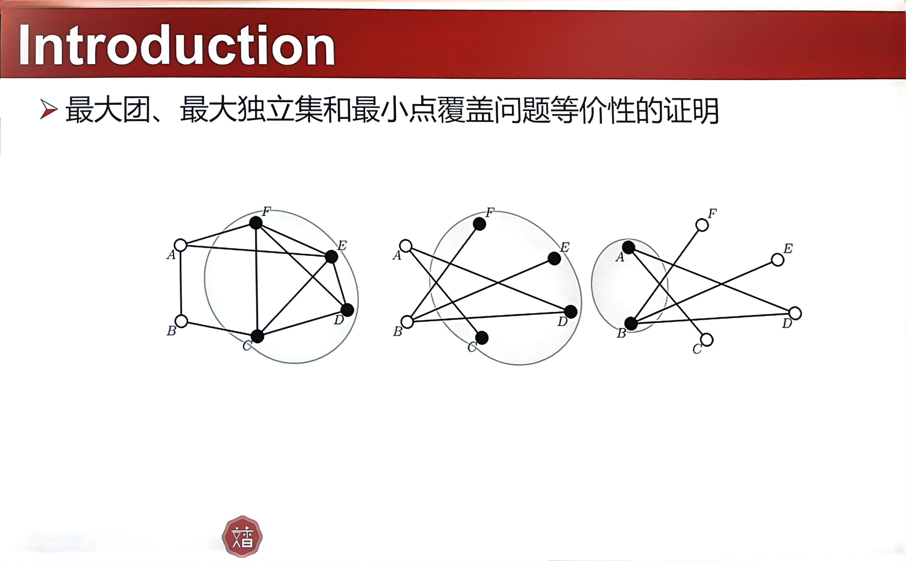

# Week 9

## 9.1树状数组

满足**交换律**，**可差分**

## 9.2 Treap

$Treap=Tree + Heap$

一个value，保持二叉搜索树的性质

一个key，保持堆的性质，也是旋转的依据

# Week13

## 13.1 Range Tree

KD Tree为什么是sqrt(n)？

fractional cascading

skip list

Range Tree如何查询最近邻？

KD Tree的弊端

* 不容易处理查询点与聚集范围较远的情况。
* 所有点在球面上，一个点在球心处。如果球心偏离一点点，会如何？如何进行实现？

## 13.2 Bounding Box

判断碰撞💥

如何判断两个三角形相交？

如何判断多个三角形组成的总体相交？

* 暴力美学：直接暴力求解
* 使用简单几何体套壳🐚

AABB：轴对齐包围盒

构建：直接求最小值、最大值。

判断：比较：中心与中心的距离，两个半长和。

OBB：带旋转的包围盒

构建：PCA，分离轴定理

## 13.3 Quadtree & Octree && BSP Tree

### 四叉树与八叉树

松散四叉树、八叉树

建树对空间划分？如何画圆、画球。

### BSP Tree

https://www.zhihu.com/column/c_1623336087870201856

# Week 14

## BVH

Bounding Volume Hierarchies层次包围盒

### 哈密顿问题

* 归约

  在多项式时间内，将一个问题的解映射到另一个问题。

* 什么是NPC？

  ▷ 问题本身是一个 NP 问题。

  ▷ 任意 NP 问题可以多项式时间归约为该问题。

* 数理逻辑

* Cook-Levin定理

  * SAT是什么？

    Propositional Satisfiability命题可满足性

* NPC问题

  * 通过3 SAT进行归约转化。

* 有向无环图中的多项式时间算法

  * 使用拓扑排序进行判断。
  * [算法小结：有向无环图中哈密顿路径问题的多项式时间算法 - 知乎 (zhihu.com)](https://zhuanlan.zhihu.com/p/343033399)

* 度量空间

  * 正定型
  * 对称性
  * 三角不等式

* 旅行商问题：

  * 找边权值最小的最短路

## k染色问题

* 在**无向联通简单图**染色。
* 当K=2时，即判断二分图。
* 当K=3时
  * 生成解法：$O(m2^n)$，判读的复杂度是$O(m)$，生成是$O(2^n)$
  * 独立集：两两不相邻两点的集合
  * 先选出n/3个点，剩余判断2染色，然后判断是否可解。为什么是n/3？

# Week_15

## 斯坦纳树

给定一个包含 $n$ 个结点和 $m$ 条带权边的无向连通图 $G=(V,E)$。再给定包含 $k$ 个结点的点集 $S$, 选出 $G$ 的子图 $G^{\prime}=(V^{\prime},E^{\prime})$, 使得

1. $S\subseteq V^{\prime};$
2. $G^{\prime}$为连通图；
3.  $E^{\prime}$ 中所有边的权值和最小。
    你只需要求出 $E^{\prime}$ 中所有边的权值和。

## 最大团问题

### 问题定义

团（clique）：原图的**完全**子图，

极大团（Maximal Clique）：不是其他团的子团的团。

最大团（Maximum Clique）：点数最多的团

### 最大团问题

给定图$G=<E,V>$，寻找最大团。

等价于，最大独立集问题，最小点覆盖问题。

寻找一个图的最大团问题，即寻找补图中的最大独立集。

1. 证明独立集
2. 证明极大
3. 证明最大

极大独立集和最大独立集

**最大独立集的解集**和与**最小点覆盖的解集**互为**补集**。

## FFT

### 基本性质

$$
f*g=\mathcal{F}^{-1}\{\mathcal{F}\{f\}\cdot\mathcal{F}\{g\}\}
$$

The time complexity of FFT is $O(n\log n)$.

The complexity of pointwise multiplication is $O( n) $

Hence convolution can be performed in $O( n\log n) .$

### 形式

$$
\hat{x}[k]=\sum_{n=0}^{N-1}e^{-i\frac{2\pi}Nnk}x[n]\quad k=0,1,\ldots,N-1
$$

