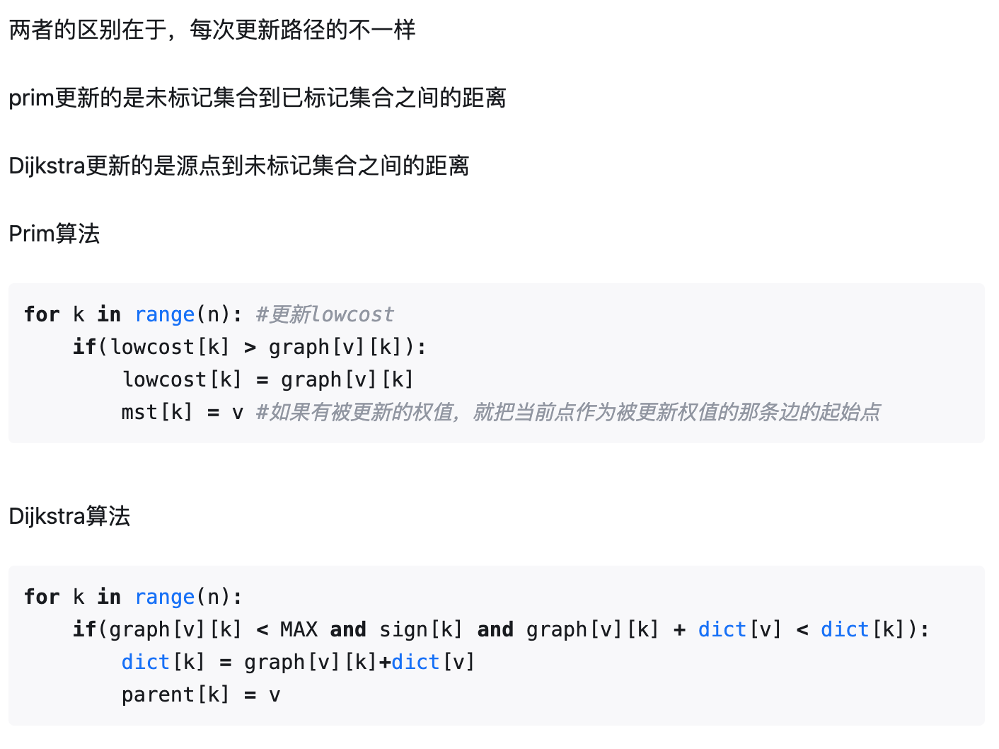
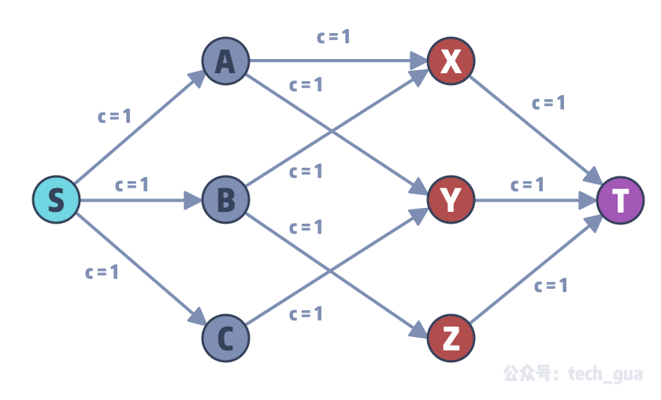
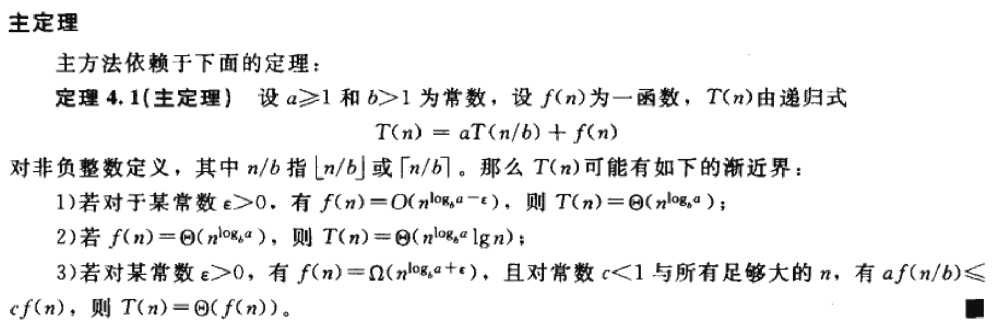

# 数据结构拾遗

## 树

### 树的遍历

* 前序遍历+中序遍历，求树结构。

  * 递归求解：
    * 取出前序遍历的第一个元素。
    * 在中序遍历中找到，作为切割点，划分成两部分。
    * 同时，前序遍历根据两部分的长度也进行划分。
  * 非递归解法：
    * 以mid_que作为跳转指针。
    * 用vis统计队首元素是否在pre_que出现。
    * 如果mid_que队首元素已经出现过，则跳到这个点，其左子树不可能再加东西

* 前序+后序

  但是可以确定基本架构，仅链状结构无法确定，即：

  1           		1

  ​	\   与 	/

    	2     2

  无法区分。

* 括号序列生成

  * 取根节点，左右节点依次入队。
  * 如果存在左右节点就“(”。
  * 如果不存在，则“)”或者“,”。

### 哈夫曼树

从森林，逐渐合成为树的过程。

### 线索二叉树

通过进行一次遍历生成，只需要在过程中记录下上一个节点即可。

### 堆

* 斐波那契堆

关键在于去除最小值后，将堆的结构重新调整，维护堆内各个根节点的度数均不相同。

* 左偏堆（可并堆）
  * 定义**外节点**为左儿子或右儿子为空的节点，定义一个外节点的$dis$为$0$，一个不是外节点的$dis$为其到子树中**最近**的外节点的距离加一。空节点的$dist$为$0$。
  * 左偏：每一个节点的左儿子都大于右儿子的$dist$。

### 平衡树

* AVL树
  * 平衡因子：$Degree_左-Degree_右$。
  * 插入新节点后进行旋转，仅仅需要一次。
  * 删除之后回溯也需要进行旋转，但是可能需要旋转多次。
* KD-Tree
  * 用于寻找最近邻点对
  * 按照维度划分。
  * 一种删除方法：用和被删除点最近（某一维度）的点替换。然后递归重建。
* 替罪羊树
  * https://riteme.site/blog/2016-4-6/scapegoat.html
  * 就是将中序遍历序列拉平，再重构成树。
* 维护前序排名
  * 维护左右子树的大小即可。
* 范围内点集

## 图论

### 最小生成树

* Prime算法

使用优先队列O(VlogV+ElogV)，通过斐波那契堆可以优化到O(VlogV+E)。

如果是稠密图，E=O(V^2)，最终复杂度是O(V ^2);

如果是稀疏图，E=O(V)，最终复杂度是O(VlogV);

邻接矩阵不太适合，需要用一个能表示相邻状态的存储方式。

* Kruskal算法

时间复杂度O(ElogE)

对于稠密图O(V^2logV)

对于稀疏图O(VlogV)

### 最短路

* Djisktra算法
  * 每次从未选择的节点集合中选择距离**起点**最近的点进行更新。
  * 

* Floyed算法 
  * 记录路径：
    * 只需要记录一个$N\times N$的矩阵，记录$i\rightarrow j$最后被哪一个节点松弛。
    * 递归查询。

* Bellman-Ford算法

  对图进行$V-1$次**边**松弛。

  时间复杂度是$O(VE)$

* SPFA

  不盲目的使用$V-1$次边松弛。

  只把把每次更新的邻居作为备选。

### 强连通分量

* Tarjan算法

	1. 处理v时，标记时间戳并将v入栈
 	2. 枚举v的邻点p，可能会出现三种情况：
     * 邻点没有被标记过时间戳。对邻点进行深搜并用low_link[v]更新low_link[u]。
     * 邻点被标记过时间戳且在栈内。说明(u,v)是返祖边或者横叉边，用dfn[v]更新low[u]
     * 邻点被标记过时间戳且不在栈内，说明邻点v所在的强连通分量已经被处理完毕，此时不需要执行任何操作。

3. 离开u时，如果u是强连通分量的根（dfn[u] == low[u），记录SCC。只有遍历完一个SCC（s[top] == u）,才可以出栈。

  这里也体现出了更新low[u]的意义：避免SCC中的节点提前出栈。

### 欧拉回路

* 判断：

* 求解：

  Fleury 算法也称避桥法，是一个偏暴力的算法。

  * 算法流程为**每次选择下一条边的时候优先选择不是桥的边**。
  * 直接dfs寻找。

* 桥：割边

* 割点：

  * 一个点不是割点，当且仅当与其相连的所有边在新图中对应的蓝点都属于同一个连通块。

### 网络流

* FF算法
  * 残差网络
* Dinic算法
  * 分层图
* 与线性规划
  * **最大流问题：**
    - 定义：在一个有向图中，每条边上有一个容量，找到从源点到汇点的最大流量路径，使得网络中的每条边的流量都不超过其容量。
    - 线性规划表示：将每条边看作线性规划的变量，目标函数是最大化总流量，约束条件包括流量守恒和容量限制。
  * **最小割问题：**
    - 定义：找到一个割，使得从源点到汇点的路径都被割断，且割的容量最小。
    - 线性规划表示：同样将每条边看作线性规划的变量，目标函数是最小化割的容量，约束条件包括流量守恒和容量限制。

### 差分约束

> 差分约束系统 是一种特殊的 $n$ 元一次不等式组，它包含 $n$ 个变量 $x_1,x_2,\ldots,x_n$ 以及 $m$ 个约束条件，每个约束条件是由两个其中的变量做差构成的，形如 $x_i-x_j\leq c_k$, 其中
>  $1\leq i,j\leq n,i\neq j,1\leq k\leq m$ 并且 $c_k$ 是常数 (可以是非负数，也可以是负数) 。我们要解决的问
>  题是：求一组解 $x_1=a_1,x_2=a_2,\ldots,x_n=a_n$, 使得所有的约束条件得到满足，否则判断出无
>  解。

* 设 $dist[0]=0$ 并向每一个点连一条权重为 0 边，跑单源最短路，若图中存在负环，则给定的差分约束系统无解，否则，$x_i=dist[i]$ 为该差分约束系统的一组解。

### 二部图

用网络流求解。



## 时间复杂度

* 主定理



* Treap
* LCT
* Splay
* KD-Tree
* Dinic
  * 这个难度太高，可以记一下$O(|V|^2|E|)$。
* 并查集

## 规划

[二分图的最大匹配、最小顶点覆盖、最大独立集等价的线性规划证明 - 知乎 (zhihu.com)](https://zhuanlan.zhihu.com/p/56164625)

* 括号表示
* 最近点对

### 01分数规划

* 二分答案。

* 有限制的话，用背包。

## 字符串算法

### KMP

https://oi-wiki.org/string/kmp/

* 前缀数组
* 确定下一个转移位置

## 线性结构：堆、栈、队列、链表

### 链表翻转

### 链表自环

* 快慢指针(Floyd判圈)

```python
DetectCycle(head):
    if head is null or head.next is null:
        return false
    
    slowPointer = head
    fastPointer = head.next
    
    while fastPointer is not null and fastPointer.next is not null:
        if slowPointer == fastPointer:
            return true  # 存在环
        
        slowPointer = slowPointer.next
        fastPointer = fastPointer.next.next
    
    return false  # 没有环
```

* 裴蜀定理：

  $ax+by=m$有整数解，当且仅当$m$是$a$及$b$的最大公约数$\gcd(a,b)$ 的倍数

  * 解释为，$a$与$b$的线性组合一定是其最大公约数的倍数。

  > 给出 $n$ 张卡片，分别有 $l_i$ 和 $c_i$。在一条无限长的纸带上，你可以选择花 $c_i$ 的钱来购买卡片 $i$, 从此以后可以向左或向右跳$l_i$ 个单位。问你至少花多少元钱才能够跳到纸带上全部位置。若不行，输出 -1。

### 排序

* 归并排序
  * 类似后序遍历将数组重排。
* 第K大元素，可以借助快排的思想进行。
  * 拿出一个基准值，用它来划分范围。

### 扩展欧几里得

* 扩展欧几里得可以通过矩阵将递归转化为非递归。

### 汉诺塔问题

* 对操作进行编码：
  * lowbit指示移动盘子编号；
  * lowbit前的编号指示移动方向。

### 排列

* 求下一个排列：

  * 从后往前，找到第一个位置$i$，使得$a[i]<a[i+1]$。
  * 找到位置在$i$之后的最小的大于$a[i]$数。
  * 交换他们。
  * $i$之后的排序。

* 求某个序列的排列排名。

  * 康托展开：朴素$O(n^2)$，树状数组优化$O(n\log n)$
    * 找到当前位置的元素有多少比他小的元素还未出现。

* 求第k个排列。

  * 阶乘数制法
  * 把k分解为：$a_4\cdot4!+a_3\cdot3!+a_2\cdot2!+a_1\cdot1!+a_0\cdot0!$.
    * 如$14=2*3!+1*2!+0*1!+0*0!=2100$

  * 把序列放在队列里面，每次取出队列（$index:0$）中对应的元素。
    * 如$abcd$的第14个排列：$bcad$。

### 跳表

* 类似将二分的思想应用于链表。

### 扫描线

> 给定若干竖直和水平的随机长度的线段，并且保证一个 y 坐标或者一个 x 坐标下只有一条线段，求这些线段的交点个数。

* 对y轴建树，遇到水平线段，左端点对应的y+1，遇到右端点对应的y-1，遇到竖直线段，区间查询。

## 算法设计

### 注意

* 对于NP问题
  * 可以设计近似算法，常常使用贪心。
* 注意处理退化情况，往往是得分点。

### 背包

伪多项式时间。

### 相邻最近点对

分治，合并。

### 凸包

* 分治+合并
* **Graham**极角排序
* Andrew算法

https://zhuanlan.zhihu.com/p/33355636